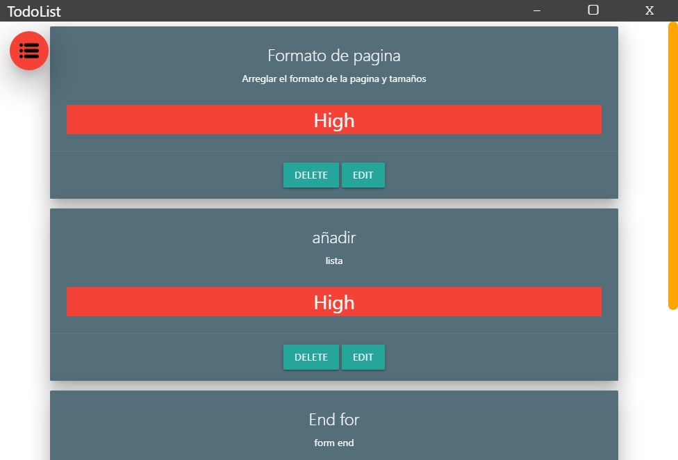
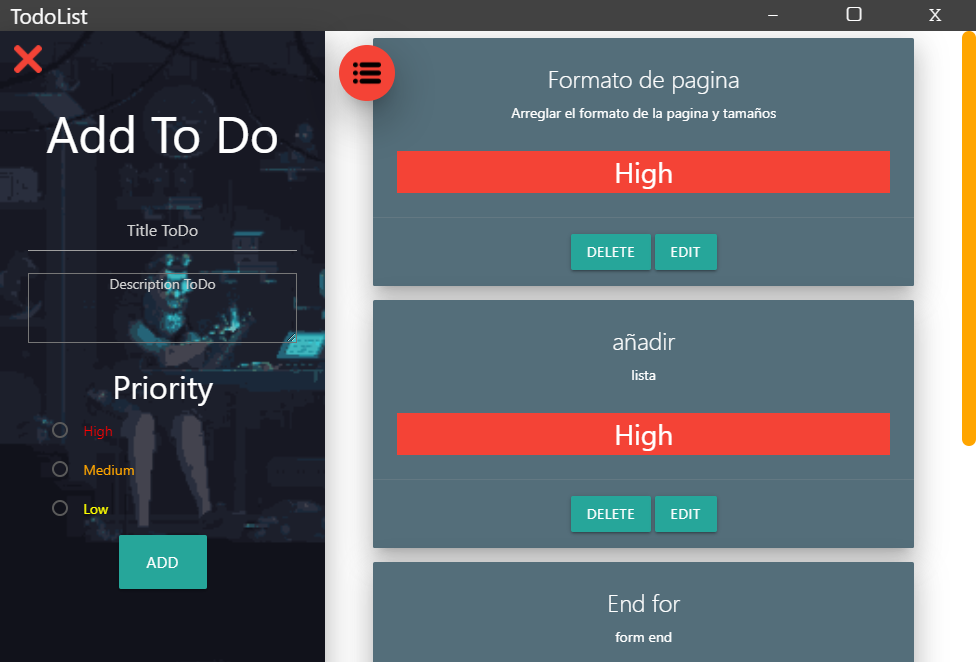
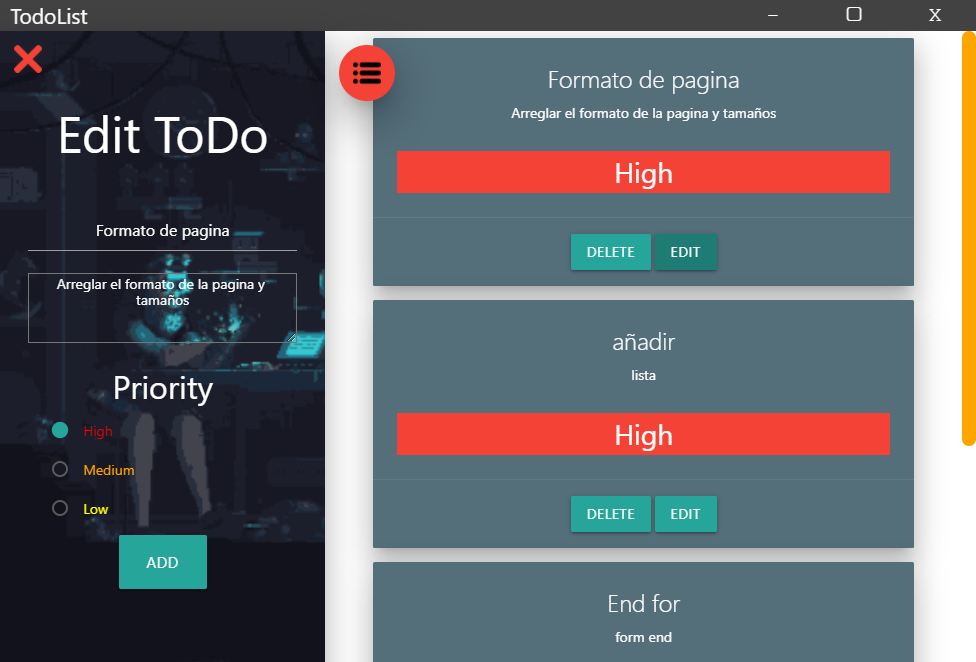

# To Do List Desktop App

## Start commands

#### Start :rocket:

```ps

  npm start

```

#### Package solution 📦

```ps

  npm run package-win 

  npm run package-mac

  npm run package-linux

```

#### Add Icon in route

### Windows

```patch

./assets/icons/win/icon.ico

```

### mac

```patch

./assets/icons/mac/icon.icns

```

### linux

```patch

./assets/icons/png/1024x1024.png

```

### Need .env file with database tokens for start :open_book:

#### Instruction 📎

- create .env file and add

```dosini

HOST=Token of host MySql DataBase.

USER= User for MySql DataBase.

PASSWORD= Password for MySql DataBase.

DATABASE= Name of MySql DataBase.

```

## Technologies

### Desktop 🖥

To Do List create with [*Electron*](electrongjs.org) :robot:

### Styles 🌟

Css with [materialize](https://materializecss.com/) and animation with [Animate.css](https://animate.style/)

### DataBase ☁

Data with MySql hosting in [CleverCloud](https://www.clever-cloud.com/en/)

## Main Page



## Show SideBar



## Show SideBar Edit


